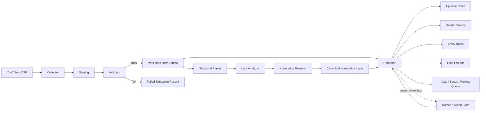

# Architecture

Status: planning reference

## Goal

Build a local-first archive and knowledge vault for the numbered Obsidian Soundfields series. The system preserves the exact source material exposed by each video, turns it into a comfortable Obsidian reading experience, and maintains a provenance-backed lore graph without mixing machine interpretation with the user's own notes.

## Non-goals

- Do not download video.
- Do not download audio.
- Do not make GitHub/publication constraints drive the local architecture yet.
- Do not let semantic analysis modify or replace preserved source material.
- Do not let rebuilds overwrite human-owned state.

## System shape



## Public module seams

TDD targets five behavioral interfaces:

1. **Collector** — Episode reference → source snapshot attempt.
2. **StructuralParser** — valid source snapshot → parsed structural representation.
3. **KnowledgeResolver** — parsed source + current knowledge state → proposed/accepted knowledge update.
4. **Renderer** — episode/knowledge model + human-owned state → Markdown projection.
5. **Validator** — episode or batch → validation report.

Regexes and helper functions are implementation details unless they later become genuine public seams.

## Data layers

### 1. Raw Source

The archival authority. Preserved exactly as retrieved by the acquisition
adapter and never edited by the parser.

"Exact" refers to the extracted source payload (for example, the description
string returned by YouTube through yt-dlp), not to raw HTML/page bytes from the
website. The system verifies that the extracted payload written into Raw Source
is not truncated or transformed before preservation.

A revision may contain:

- complete YouTube description
- original English manual captions, when available
- original English automatic captions, when available
- metadata JSON
- highest-quality available thumbnail in its original retrieved format
- manifest
- hashes

A material source change creates a new revision instead of replacing the previous one.

Readable revision directory format:

```text
2026-09-25_05-43-00Z/
```

### 2. Reader Source

A generated Markdown projection intended for reading in Obsidian.

It may add safe `[[wiki-links]]` for already confirmed canonical targets while preserving the Raw Source as the authority for exact wording.

The main YouTube Description remains expanded. Additional caption tracks are displayed in collapsible sections.

### 3. Canonical Knowledge Layer

Stores relationships once and renders them into all affected notes.

Relationship states:

- candidate
- confirmed
- inferred
- rejected
- reopened

Every relationship stores provenance/evidence.

An explicit numbered reference such as `Terminal OSF-053` may be auto-confirmed when it resolves unambiguously. Semantic or fuzzy similarities are never silently confirmed.

### 4. Human-Owned State

Automation must preserve:

- favorite
- rating
- reading status
- last_read
- My Notes
- personal theories
- manually reviewed relationship decisions

Personal rating uses a 1–10 numeric scale.

The `osf-vault` agent skill is allowed to update this human-owned state and
personal research notes, but remains outside the ingestion pipeline.

### Frontmatter ownership

Episode frontmatter contains both machine-owned and human-owned properties.
The Renderer must parse and merge properties by ownership instead of replacing
the entire YAML block.

Human-owned keys include:

- `favorite`
- `rating`
- `status`
- `last_read`

Machine-owned keys may include source identity, parser/schema versions,
ingestion status, publication metadata, and generated relationship indexes.

No-clobber behavior is part of the Renderer TDD contract.

## Ingestion lifecycle

```text
retrieve into staging
→ verify required files
→ hash
→ validate source integrity
→ promote atomically
→ parse
→ resolve knowledge
→ render
→ validate episode
→ validate batch
```

If retrieval fails, the attempt is marked failed and the last valid revision remains current.

## Source revision rules

A new Source Revision is created when any preserved archival source changes:

- description
- original manual English captions
- original automatic English captions
- thumbnail bytes

Mutable popularity metadata such as views, likes, or comment counts does not
create a Source Revision and is excluded from the revision fingerprint.

Thumbnail history is retained with revisions. A convenient current thumbnail is also exposed for normal Obsidian use.

The revision fingerprint is computed only from archival source artifacts and
stable source identity fields, not the entire mutable `info.json`.

## Idempotence

Re-running ingestion must be safe:

- unchanged source → no duplicate revision
- parser/schema change → regenerate derived projections without refetching source where possible
- changed source → create a new revision
- failed retrieval → keep last valid revision current and record failure

Generated artifacts record `schema_version` and `parser_version`.

## Batch quality gates

A batch may be **ingestion complete** while lore review is still pending.

Per Episode ingestion checks include:

- metadata fetched
- complete description preserved
- available original English captions preserved
- best thumbnail preserved
- hashes generated
- Reader Source rendered
- exact-source checks pass
- Episode Note rendered
- explicit OSF references resolved
- internal links validated
- human-owned state unchanged
- requested source tracks verified against the extractor's reported availability

The Validator must not treat yt-dlp process success alone as proof that requested
subtitle/caption files were actually produced. It verifies expected artifacts
and manifests explicitly.

Batch ingestion completion requires all Episodes in the batch to pass and no silent truncation or unresolved extraction failure.

Lore review completion is a separate state.

## Planned physical layout

```text
00 Atlas/
01 Episodes/
02 Entities/
  Places/
  Organizations/
  Systems/
  Phenomena/
  People/
03 Lore Threads/
04 My Notes/
05 Sources/
06 Assets/
  Thumbnails/
90 Templates/
tools/
tests/
.osf/
docs/
  adr/
CONTEXT.md
```

The current scaffold predates this architecture and is disposable except for approved planning documentation and ADRs.

## Local Git history

The vault remains a local Git worktree as a rollback/history mechanism even
while GitHub/public distribution is out of scope.

Agentic note-taking through `osf-vault` may create narrow local commits after
successful changes. Automatic pushes are out of scope.

Raw revision archives and binary thumbnail caches do not need Git to provide
their history because Source Revisions are already immutable/versioned by the
collector. The implementation should avoid needlessly duplicating large binary
artifacts in Git history; exact ignore/tracking rules are finalized with the
scaffold.
